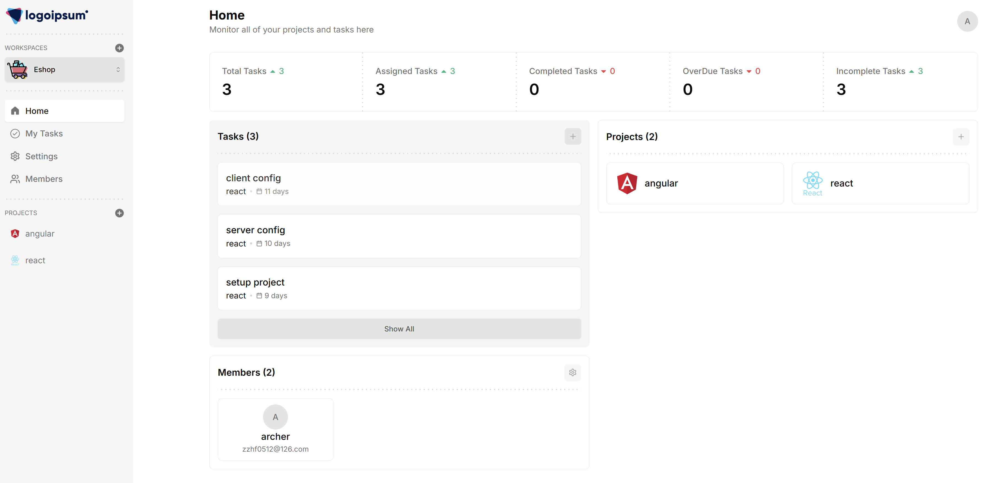
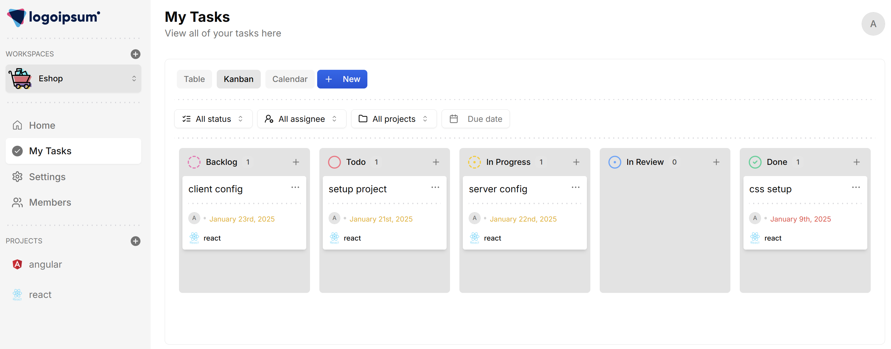
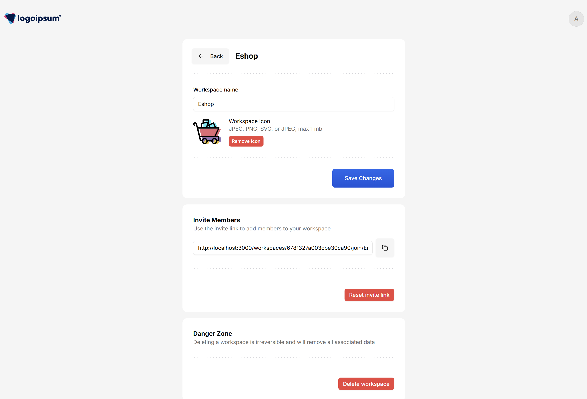

# Built a Fullstack team work space with React, Next.js, TailwindCSS & Appwrite

- [Dashboard]

- [tasks view kanban]

- [workspace settings]
- 

Key Features:
```
🏢 Workspaces
📊 Projects / Epics
✅ Tasks
📋 Kanban Board View
🗃️ Data Table View
📅 Calendar View
✉️ Invite System
⚙️ Workspace and Project Settings
🖼️ Image Uploads (for avatars and attachments)
🔌 Appwrite SDK Integration
⚛️ Next.js 14 Framework
🎨 Shadcn UI & TailwindCSS Styling
🔍 Advanced Search and Filtering
📈 Analytics Dashboard
👥 User Roles and Permissions
🔒 Authentication (OAuth and Email)
📱 Responsive Design (Mobile-friendly)
🚀 API using Hono.js
```
### Prerequisites

**Node version 14.x**

### Cloning the repository

```shell
git clone https://github.com/archerzou/team-work.git
```

### Install packages

```shell
npm i
```

### Setup .env file

```js
NEXT_PUBLIC_APP_URL= "http://localhost:3000"

NEXT_PUBLIC_APPWRITE_ENDPOINT=
NEXT_PUBLIC_APPWRITE_PROJECT=

NEXT_PUBLIC_APPWRITE_DATABASE_ID=
NEXT_PUBLIC_APPWRITE_WORKSPACES_ID=
NEXT_PUBLIC_APPWRITE_MEMBERS_ID=
NEXT_PUBLIC_APPWRITE_IMAGES_BUCKET_ID=
NEXT_PUBLIC_APPWRITE_PROJECTS_ID=
NEXT_PUBLIC_APPWRITE_TASKS_ID=
NEXT_APPWRITE_KEY=0
```

### Start the app

```shell
npm run dev
```
